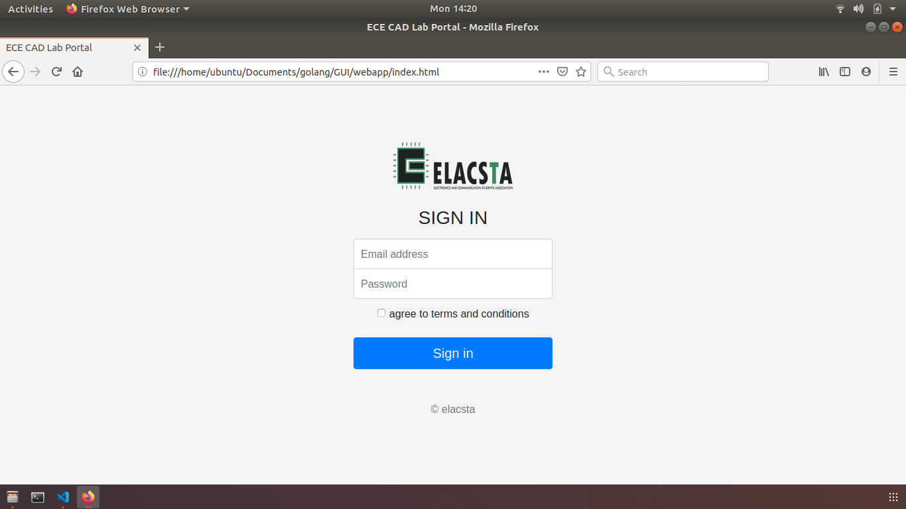

# Golang
### Tinkerhub - learn from home
=======
## Graphical User Interface for creating a database
=======
## Descirption :
GUI based database creator and archiver to store Data in efficient manner directly from a user.

Purpose is to create a gui sign in portal that takes studen/teacher credentials and to store the data in a csv file.
this is to be implemented in a computerlab, to collect data from all computers.

gui signin portal:

Now in the backend the using golang we parse the values of the form and save it to sqlite3 database. And exported to a csv file.

Future plans: to update the google sheets in real time whenevr the user logs in the system with time stamp. So owner (here Staff incharge) can view in real time.
